```python
import subprocess, sys

for pkg in ['pandas', 'numpy', 'matplotlib', 'seaborn', 'plotly', 'openpyxl']:
    subprocess.check_call ([sys.executable, '-m', 'pip', 'install', pkg, '-q'])
    print('All libraries are ready!')
```

    All libraries are ready!
    All libraries are ready!
    All libraries are ready!
    All libraries are ready!
    All libraries are ready!
    All libraries are ready!
    


```python
import pandas as pd
import numpy as np
import matplotlib.pyplot as plt
import seaborn as sns
import plotly.express as px
import plotly.graph_objects as go
from plotly.subplots import make_subplots
import warnings

warnings.filterwarnings('ignore')
sns.set_style('whitegrid')
plt.rcParams['figure.figsize'] = (10, 5)

print('Libraries imported successfully')
```

    Libraries imported successfully
    


```python
#data as dt
dt = pd.read_excel('sales_records_dataset.xlsx')
print(f'Dataset loaded! Shape: {dt.shape[0]} rows × {dt.shape[1]} columns')
```

    Dataset loaded! Shape: 1000 rows × 14 columns
    


```python
dt.head()
```


<div>
<style scoped>
    .dataframe tbody tr th:only-of-type {
        vertical-align: middle;
    }

    .dataframe tbody tr th {
        vertical-align: top;
    }

    .dataframe thead th {
        text-align: right;
    }
</style>
<table border="1" class="dataframe">
  <thead>
    <tr style="text-align: right;">
      <th></th>
      <th>Order_ID</th>
      <th>Customer_Name</th>
      <th>Gender</th>
      <th>Region</th>
      <th>Product_Category</th>
      <th>Product_Name</th>
      <th>Quantity</th>
      <th>Unit_Price</th>
      <th>Total_Sales</th>
      <th>Discount</th>
      <th>Profit</th>
      <th>Order_Date</th>
      <th>Payment_Method</th>
      <th>Sales_Rep</th>
    </tr>
  </thead>
  <tbody>
    <tr>
      <th>0</th>
      <td>ORD1001</td>
      <td>Zainab James</td>
      <td>Female</td>
      <td>West</td>
      <td>Electronics</td>
      <td>Laptop</td>
      <td>3.0</td>
      <td>21785.0</td>
      <td>65355.0</td>
      <td>4346.0</td>
      <td>11889.607718</td>
      <td>2022-07-18</td>
      <td>Cash</td>
      <td>Rep_D</td>
    </tr>
    <tr>
      <th>1</th>
      <td>NaN</td>
      <td>Zainab Okafor</td>
      <td>Male</td>
      <td>East</td>
      <td>Clothing</td>
      <td>Jeans</td>
      <td>2.0</td>
      <td>69255.0</td>
      <td>138510.0</td>
      <td>903.0</td>
      <td>17920.557815</td>
      <td>2024-09-18</td>
      <td>Online</td>
      <td>Rep_A</td>
    </tr>
    <tr>
      <th>2</th>
      <td>ORD1003</td>
      <td>Samuel Abdullahi</td>
      <td>Male</td>
      <td>South</td>
      <td>Clothing</td>
      <td>Shirt</td>
      <td>9.0</td>
      <td>106459.0</td>
      <td>958131.0</td>
      <td>171.0</td>
      <td>56257.963706</td>
      <td>2023-09-11</td>
      <td>POS</td>
      <td>Rep_C</td>
    </tr>
    <tr>
      <th>3</th>
      <td>ORD1004</td>
      <td>Daniel Balogun</td>
      <td>Female</td>
      <td>East</td>
      <td>Furniture</td>
      <td>Bed</td>
      <td>5.0</td>
      <td>102967.0</td>
      <td>514835.0</td>
      <td>3286.0</td>
      <td>87530.327068</td>
      <td>NaN</td>
      <td>Cash</td>
      <td>Rep_B</td>
    </tr>
    <tr>
      <th>4</th>
      <td>ORD1005</td>
      <td>Ibrahim Khan</td>
      <td>Male</td>
      <td>West</td>
      <td>Electronics</td>
      <td>Laptop</td>
      <td>7.0</td>
      <td>148887.0</td>
      <td>1042209.0</td>
      <td>741.0</td>
      <td>67011.935599</td>
      <td>2022-06-03</td>
      <td>Transfer</td>
      <td>Rep_D</td>
    </tr>
  </tbody>
</table>
</div>


```python
dt.info()
```

    <class 'pandas.core.frame.DataFrame'>
    RangeIndex: 1000 entries, 0 to 999
    Data columns (total 14 columns):
     #   Column            Non-Null Count  Dtype  
    ---  ------            --------------  -----  
     0   Order_ID          955 non-null    object 
     1   Customer_Name     956 non-null    object 
     2   Gender            949 non-null    object 
     3   Region            941 non-null    object 
     4   Product_Category  944 non-null    object 
     5   Product_Name      961 non-null    object 
     6   Quantity          955 non-null    float64
     7   Unit_Price        949 non-null    float64
     8   Total_Sales       942 non-null    float64
     9   Discount          950 non-null    float64
     10  Profit            947 non-null    float64
     11  Order_Date        945 non-null    object 
     12  Payment_Method    944 non-null    object 
     13  Sales_Rep         955 non-null    object 
    dtypes: float64(5), object(9)
    memory usage: 109.5+ KB
    


```python
dt.describe().round(2)
```


<div>
<style scoped>
    .dataframe tbody tr th:only-of-type {
        vertical-align: middle;
    }

    .dataframe tbody tr th {
        vertical-align: top;
    }

    .dataframe thead th {
        text-align: right;
    }
</style>
<table border="1" class="dataframe">
  <thead>
    <tr style="text-align: right;">
      <th></th>
      <th>Quantity</th>
      <th>Unit_Price</th>
      <th>Total_Sales</th>
      <th>Discount</th>
      <th>Profit</th>
    </tr>
  </thead>
  <tbody>
    <tr>
      <th>count</th>
      <td>955.00</td>
      <td>949.00</td>
      <td>942.00</td>
      <td>950.00</td>
      <td>947.00</td>
    </tr>
    <tr>
      <th>mean</th>
      <td>5.53</td>
      <td>75752.28</td>
      <td>424735.26</td>
      <td>2513.22</td>
      <td>64645.40</td>
    </tr>
    <tr>
      <th>std</th>
      <td>2.85</td>
      <td>42736.95</td>
      <td>339359.57</td>
      <td>1463.39</td>
      <td>61028.39</td>
    </tr>
    <tr>
      <th>min</th>
      <td>1.00</td>
      <td>2037.00</td>
      <td>2118.00</td>
      <td>0.00</td>
      <td>171.57</td>
    </tr>
    <tr>
      <th>25%</th>
      <td>3.00</td>
      <td>38059.00</td>
      <td>133941.50</td>
      <td>1271.00</td>
      <td>17417.64</td>
    </tr>
    <tr>
      <th>50%</th>
      <td>6.00</td>
      <td>76180.00</td>
      <td>357334.50</td>
      <td>2497.50</td>
      <td>46940.54</td>
    </tr>
    <tr>
      <th>75%</th>
      <td>8.00</td>
      <td>112145.00</td>
      <td>621387.25</td>
      <td>3796.25</td>
      <td>93647.07</td>
    </tr>
    <tr>
      <th>max</th>
      <td>10.00</td>
      <td>149555.00</td>
      <td>1492040.00</td>
      <td>4996.00</td>
      <td>356652.16</td>
    </tr>
  </tbody>
</table>
</div>


```python
# missing = dt.isnull().sum()
# missing_pct = (missing / len(dt) * 100).round(2)

# missing_df = pd.DataFrame({
#     'Missing Count': missing,
#     'Missing &': missing_pct
# })
# missing_df = missing_df[missing_df['Missing Count'] > 0]
# missing_df = missing_df.sort_values(by='Missing %', ascending=False)

# print("Columns with missing values:")
# print(missing_df.to_string())
```


```python
missing = dt.isnull().sum()
missing_dt = missing.to_frame(name='Missing Count')
missing_dt['Missing %'] = (missing_dt['Missing Count'] / len(dt) * 100).round(2)
missing_dt = missing_dt[missing_dt['Missing Count'] > 0]
missing_dt = missing_dt.sort_values(by='Missing %', ascending=False)
print("Columns with missing values:")
print(missing_dt.to_string())
```

    Columns with missing values:
                      Missing Count  Missing %
    Region                       59        5.9
    Total_Sales                  58        5.8
    Product_Category             56        5.6
    Payment_Method               56        5.6
    Order_Date                   55        5.5
    Profit                       53        5.3
    Gender                       51        5.1
    Unit_Price                   51        5.1
    Discount                     50        5.0
    Order_ID                     45        4.5
    Quantity                     45        4.5
    Sales_Rep                    45        4.5
    Customer_Name                44        4.4
    Product_Name                 39        3.9
    


```python
fig, ax = plt.subplots(figsize=(12, 5))
missing_dt['Missing %'].plot(kind='bar', ax=ax)
ax.set_title('Missing Values per Column (%)')
ax.set_xlabel('Column')
ax.set_ylabel('Missing %')
ax.axhline(5, linestyle='--', label='5% threshold')
ax.legend()
plt.xticks(rotation=45)
plt.tight_layout()
plt.show()
```


    
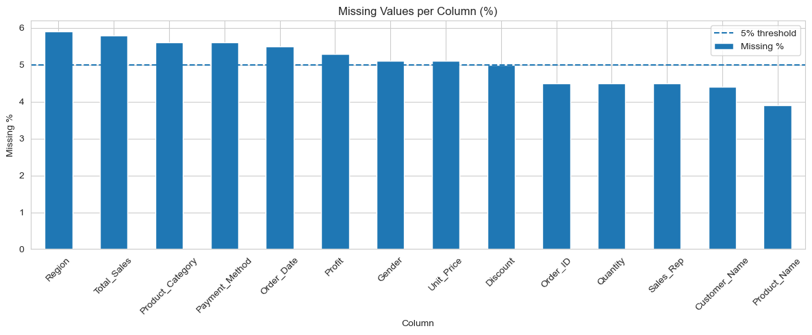
    


```python
cat_cols=['Gender', 'Region', 'Product_Category','Payment_Method', 'Sales_Rep']
for col in cat_cols:  
    print(f'\n📌 {col}:')
print(dt[col].value_counts(dropna=False).to_string())
```

    
    📌 Gender:
    
    📌 Region:
    
    📌 Product_Category:
    
    📌 Payment_Method:
    
    📌 Sales_Rep:
    Sales_Rep
    Rep_D    251
    Rep_A    249
    Rep_C    230
    Rep_B    225
    NaN       45
    


```python
dupes = dt.duplicated().sum()
print(f"Numbers of duplicate rows:{dupes}")
```

    Numbers of duplicate rows:0
    


```python
dt_clean=dt.copy()
print(f"Working copy created. shape:{dt_clean.shape}")
```

    Working copy created. shape:(1000, 14)
    


```python
dt_clean['Order_Date']= pd.to_datetime(dt_clean['Order_Date'],errors='coerce')
print('Order_Date dtype after fix:', dt_clean['Order_Date'].dtype) 
print('Sample dates:', dt_clean['Order_Date'].dropna().head(5).tolist())
```

    Order_Date dtype after fix: datetime64[ns]
    Sample dates: [Timestamp('2022-07-18 00:00:00'), Timestamp('2024-09-18 00:00:00'), Timestamp('2023-09-11 00:00:00'), Timestamp('2022-06-03 00:00:00'), Timestamp('2023-07-12 00:00:00')]
    


```python
before = len(dt_clean) 
dt_clean.drop_duplicates(inplace=True) 
after = len(dt_clean) 
  
print(f'Rows before: {before} | After: {after} | Removed: {before - after}') 
```

    Rows before: 1000 | After: 1000 | Removed: 0
    


```python
dt_clean['Quantity']=dt_clean['Quantity'].fillna(dt_clean['Quantity'].median())
dt_clean['Unit_Price']=dt_clean['Unit_Price'].fillna(dt_clean['Unit_Price'].median())
dt_clean['Total_Sales']=dt_clean['Total_Sales'].fillna(dt_clean['Total_Sales'].median())
dt_clean['Profit']=dt_clean['Profit'].fillna(dt_clean['Profit'].median())
dt_clean['Discount']=dt_clean['Discount'].fillna(0)
print('Numeric columns — remaining missing values:') 
print(dt_clean[['Quantity','Unit_Price','Total_Sales','Profit','Discount']].isnull(
).sum())
```

    Numeric columns — remaining missing values:
    Quantity       0
    Unit_Price     0
    Total_Sales    0
    Profit         0
    Discount       0
    dtype: int64
    


```python
for col in ['Gender', 'Region', 'Product_Category', 'Payment_Method']: 
    mode_val = dt_clean[col].mode()[0] 
    dt_clean[col].fillna(mode_val, inplace=True) 
  
for col in ['Sales_Rep', 'Customer_Name', 'Order_ID', 'Product_Name']: 
    dt_clean[col].fillna('Unknown', inplace=True) 
  
dt_clean.dropna(subset=['Order_Date'], inplace=True) 
  
print('Remaining missing values after cleaning:') 
print(dt_clean.isnull().sum()) 
  
 
```

    Remaining missing values after cleaning:
    Order_ID            0
    Customer_Name       0
    Gender              0
    Region              0
    Product_Category    0
    Product_Name        0
    Quantity            0
    Unit_Price          0
    Total_Sales         0
    Discount            0
    Profit              0
    Order_Date          0
    Payment_Method      0
    Sales_Rep           0
    dtype: int64
    


```python
dt_clean['Year']          = dt_clean['Order_Date'].dt.year 
dt_clean['Month']         = dt_clean['Order_Date'].dt.month 
dt_clean['Month_Name']    = dt_clean['Order_Date'].dt.strftime('%b') 
dt_clean['Quarter']       = dt_clean['Order_Date'].dt.to_period('Q').astype(str) 
dt_clean['Profit_Margin'] = (dt_clean['Profit'] / dt_clean['Total_Sales'] * 
100).round(2) 
  
print('New columns added:', 
['Year','Month','Month_Name','Quarter','Profit_Margin']) 
dt_clean[['Order_Date','Year','Month','Month_Name','Quarter','Profit_Margin']].head()
print(f'Clean dataset shape: {dt_clean.shape}') 
print(f'Rows removed during cleaning: {len(dt) - len(dt_clean)}') 
dt_clean.head(3)
```

    New columns added: ['Year', 'Month', 'Month_Name', 'Quarter', 'Profit_Margin']
    Clean dataset shape: (945, 19)
    Rows removed during cleaning: 55
    


<div>
<style scoped>
    .dataframe tbody tr th:only-of-type {
        vertical-align: middle;
    }

    .dataframe tbody tr th {
        vertical-align: top;
    }

    .dataframe thead th {
        text-align: right;
    }
</style>
<table border="1" class="dataframe">
  <thead>
    <tr style="text-align: right;">
      <th></th>
      <th>Order_ID</th>
      <th>Customer_Name</th>
      <th>Gender</th>
      <th>Region</th>
      <th>Product_Category</th>
      <th>Product_Name</th>
      <th>Quantity</th>
      <th>Unit_Price</th>
      <th>Total_Sales</th>
      <th>Discount</th>
      <th>Profit</th>
      <th>Order_Date</th>
      <th>Payment_Method</th>
      <th>Sales_Rep</th>
      <th>Year</th>
      <th>Month</th>
      <th>Month_Name</th>
      <th>Quarter</th>
      <th>Profit_Margin</th>
    </tr>
  </thead>
  <tbody>
    <tr>
      <th>0</th>
      <td>ORD1001</td>
      <td>Zainab James</td>
      <td>Female</td>
      <td>West</td>
      <td>Electronics</td>
      <td>Laptop</td>
      <td>3.0</td>
      <td>21785.0</td>
      <td>65355.0</td>
      <td>4346.0</td>
      <td>11889.607718</td>
      <td>2022-07-18</td>
      <td>Cash</td>
      <td>Rep_D</td>
      <td>2022</td>
      <td>7</td>
      <td>Jul</td>
      <td>2022Q3</td>
      <td>18.19</td>
    </tr>
    <tr>
      <th>1</th>
      <td>Unknown</td>
      <td>Zainab Okafor</td>
      <td>Male</td>
      <td>East</td>
      <td>Clothing</td>
      <td>Jeans</td>
      <td>2.0</td>
      <td>69255.0</td>
      <td>138510.0</td>
      <td>903.0</td>
      <td>17920.557815</td>
      <td>2024-09-18</td>
      <td>Online</td>
      <td>Rep_A</td>
      <td>2024</td>
      <td>9</td>
      <td>Sep</td>
      <td>2024Q3</td>
      <td>12.94</td>
    </tr>
    <tr>
      <th>2</th>
      <td>ORD1003</td>
      <td>Samuel Abdullahi</td>
      <td>Male</td>
      <td>South</td>
      <td>Clothing</td>
      <td>Shirt</td>
      <td>9.0</td>
      <td>106459.0</td>
      <td>958131.0</td>
      <td>171.0</td>
      <td>56257.963706</td>
      <td>2023-09-11</td>
      <td>POS</td>
      <td>Rep_C</td>
      <td>2023</td>
      <td>9</td>
      <td>Sep</td>
      <td>2023Q3</td>
      <td>5.87</td>
    </tr>
  </tbody>
</table>
</div>


```python
fig, axes = plt.subplots(2, 3, figsize=(16, 9)) 
axes = axes.flatten() 
  
cat_cols = ['Gender', 'Region', 'Product_Category', 'Payment_Method', 'Sales_Rep'] 
colors   = ['#2196F3', '#4CAF50', '#FF9800', '#9C27B0', '#F44336'] 
  
for i, col in enumerate(cat_cols): 
    counts = dt_clean[col].value_counts() 
    axes[i].bar(counts.index, counts.values, color=colors[i], edgecolor='white') 
    axes[i].set_title(f'Distribution of {col}', fontweight='bold') 
    axes[i].set_xlabel(col) 
    axes[i].set_ylabel('Count') 
    for j, v in enumerate(counts.values): 
        axes[i].text(j, v + 2, str(v), ha='center', fontsize=9) 
  
axes[5].set_visible(False) 
plt.suptitle('Class Distribution Check', fontsize=16, fontweight='bold', y=1.01) 
plt.tight_layout() 
plt.show()

print('Imbalance Ratios (max / min count per category)\n') 
for col in cat_cols: 
    counts = dt_clean[col].value_counts() 
    ratio  = counts.max() / counts.min() 
    status = 'Balanced' if ratio <= 2.0 else '⚠️ Imbalanced' 
    print(f'{col:<20} Ratio: {ratio:.2f}  {status}') 
```


    
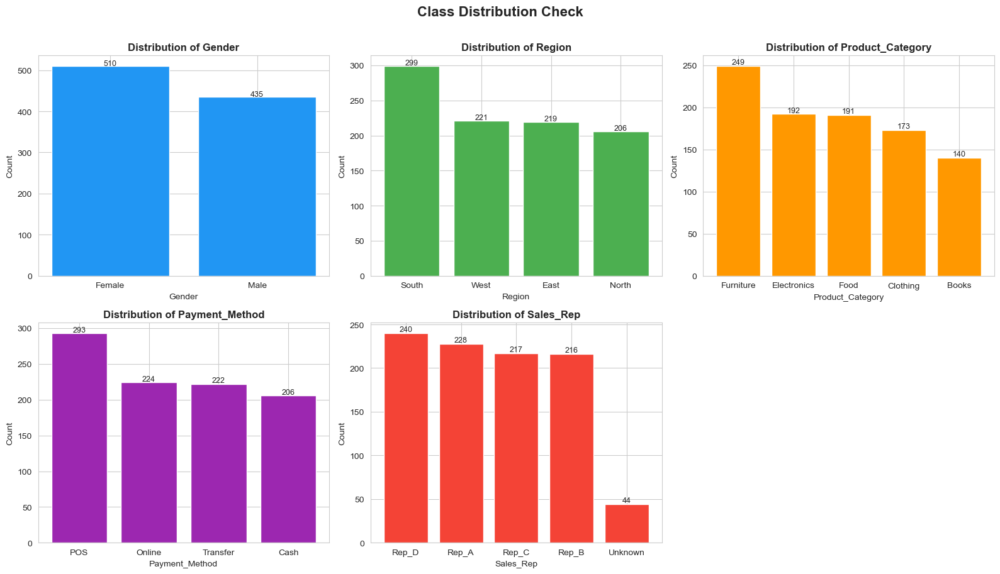
    


    Imbalance Ratios (max / min count per category)
    
    Gender               Ratio: 1.17  Balanced
    Region               Ratio: 1.45  Balanced
    Product_Category     Ratio: 1.78  Balanced
    Payment_Method       Ratio: 1.42  Balanced
    Sales_Rep            Ratio: 5.45  ⚠️ Imbalanced
    


```python
APPLY_BALANCING = False   # Change to True to activate 
BALANCE_COLUMN  = 'Product_Category' 
  
if APPLY_BALANCING: 
    min_count   = dt_clean[BALANCE_COLUMN].value_counts().min() 
    dt_balanced = ( 
        dt_clean.groupby(BALANCE_COLUMN) 
                .apply(lambda x: x.sample(min_count, random_state=42)) 
                .reset_index(drop=True) 
    ) 
    print(f'Balanced shape: {dt_balanced.shape}') 
    print(dt_balanced[BALANCE_COLUMN].value_counts()) 
else: 
    dt_balanced = dt_clean.copy() 
    print('Using the full cleaned dataset.') 
    print(f'Shape: {dt_balanced.shape}') 
```

    Using the full cleaned dataset.
    Shape: (945, 19)
    


```python
num_cols = ['Quantity', 'Unit_Price', 'Total_Sales', 'Profit', 'Discount'] 
  
fig, axes = plt.subplots(2, 3, figsize=(16, 8)) 
axes = axes.flatten() 
  
for i, col in enumerate(num_cols): 
    axes[i].hist(dt_balanced[col], bins=30, color='#1976D2', 
                 edgecolor='white', alpha=0.85) 
    axes[i].set_title(f'Distribution: {col}', fontweight='bold') 
    axes[i].set_xlabel(col) 
    axes[i].set_ylabel('Frequency') 
  
axes[5].set_visible(False) 
plt.suptitle('Numeric Feature Distributions', fontsize=15, fontweight='bold') 
plt.tight_layout() 
plt.show() 
```


    
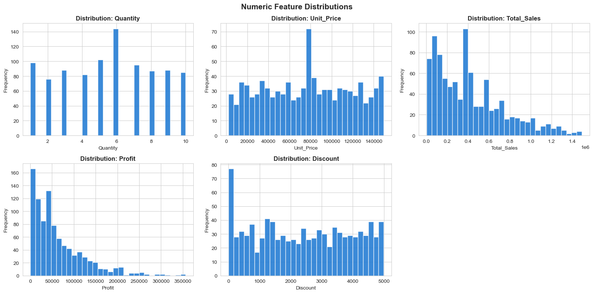
    


```python
cat_sales = dt_balanced.groupby('Product_Category')['Total_Sales'].sum().sort_values(ascending=True) 
  
fig, ax = plt.subplots(figsize=(10, 5)) 
colors  = plt.cm.Blues(np.linspace(0.4, 0.9, len(cat_sales))) 
bars    = ax.barh(cat_sales.index, cat_sales.values / 1e6, color=colors, 
edgecolor='white') 
  
for bar, val in zip(bars, cat_sales.values): 
    ax.text(bar.get_width() + 0.5, bar.get_y() + bar.get_height()/2, 
            f'₦{val/1e6:.1f}M', va='center', fontsize=9) 
  
ax.set_title('Total Sales by Product Category', fontsize=14, fontweight='bold') 
ax.set_xlabel('Total Sales (Millions ₦)') 
plt.tight_layout() 
plt.show() 
```


    
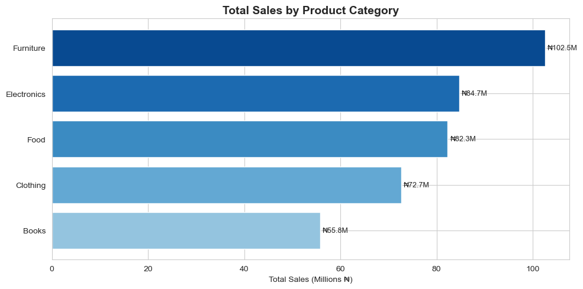
    


```python
monthly = (dt_balanced.groupby(['Year','Month'])[['Total_Sales','Profit']] 
               .sum().reset_index().sort_values(['Year','Month'])) 
monthly['Period'] = monthly['Year'].astype(str) + '-' + monthly['Month'].astype(str).str.zfill(2) 
  
fig, ax = plt.subplots(figsize=(14, 5)) 
ax.plot(monthly['Period'], monthly['Total_Sales']/1e6, 
        marker='o', color='#1976D2', label='Total Sales', linewidth=2) 
ax.plot(monthly['Period'], monthly['Profit']/1e6, 
        marker='s', color='#4CAF50', label='Profit', linewidth=2) 
ax.set_title('Monthly Sales & Profit Trend', fontsize=14, fontweight='bold') 
ax.set_xlabel('Period (YYYY-MM)') 
ax.set_ylabel('Amount (Millions ₦)') 
ax.legend() 
plt.xticks(rotation=90) 
plt.tight_layout() 
plt.show()  
```


    
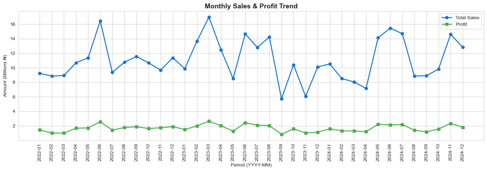
    


```python
region_profit = dt_balanced.groupby('Region')['Profit'].sum().sort_values(ascending=False) 
  
fig, ax = plt.subplots(figsize=(9, 5)) 
palette = ['#1565C0','#1976D2','#42A5F5','#90CAF9'] 
bars    = ax.bar(region_profit.index, region_profit.values/1e6, color=palette, edgecolor='white') 
  
for bar, val in zip(bars, region_profit.values): 
    ax.text(bar.get_x() + bar.get_width()/2, bar.get_height() + 0.5, f'₦{val/1e6:.1f}M', ha='center', fontsize=10) 
  
ax.set_title('Total Profit by Region', fontsize=14, fontweight='bold') 
ax.set_ylabel('Profit (Millions ₦)') 
plt.tight_layout() 
plt.show() 
```


    
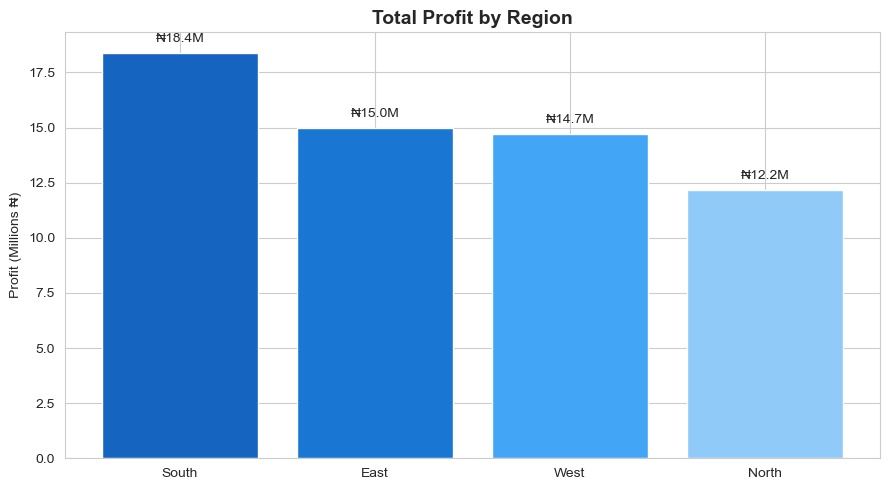
    


```python
pay_counts = dt_balanced['Payment_Method'].value_counts() 
fig, ax = plt.subplots(figsize=(7, 7)) 
wedges, texts, autotexts = ax.pie( 
    pay_counts.values, 
    labels=pay_counts.index, 
    autopct='%1.1f%%', 
    startangle=140, 
    wedgeprops={'width': 0.5}, 
    colors=['#1976D2','#4CAF50','#FF9800','#9C27B0'] 
) 
for t in autotexts: 
    t.set_fontsize(11) 
ax.set_title('Payment Method Distribution', fontsize=14, fontweight='bold') 
plt.tight_layout() 
plt.show()
```


    
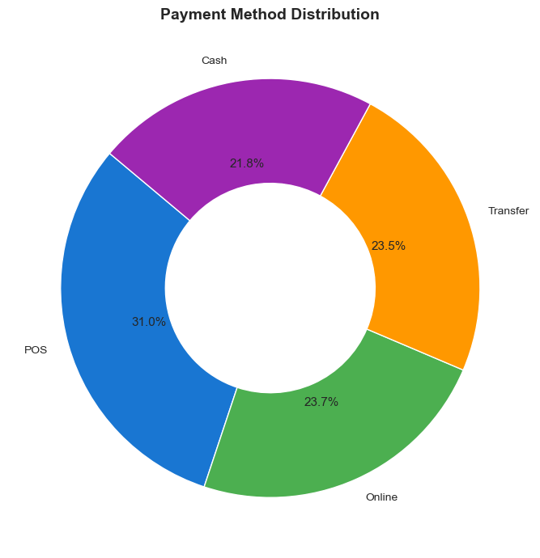
    


```python
rep_perf = ( 
    dt_balanced.groupby('Sales_Rep')[['Total_Sales','Profit']] 
               .sum().sort_values('Total_Sales', ascending=False) 
) 
  
fig, ax = plt.subplots(figsize=(10, 5)) 
x, w = np.arange(len(rep_perf)), 0.35 
  
ax.bar(x - w/2, rep_perf['Total_Sales']/1e6, width=w, label='Total Sales', 
color='#1976D2') 
ax.bar(x + w/2, rep_perf['Profit']/1e6,      width=w, label='Profit',      
color='#4CAF50') 
ax.set_xticks(x) 
ax.set_xticklabels(rep_perf.index) 
ax.set_title('Sales Rep Performance', fontsize=14, fontweight='bold') 
ax.set_ylabel('Amount (Millions ₦)') 
ax.legend() 
plt.tight_layout() 
plt.show()
```


    
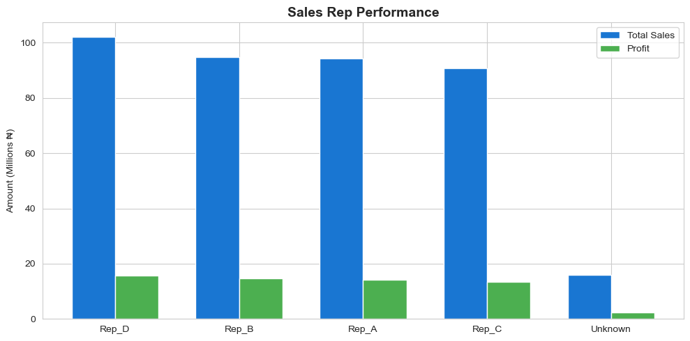
    


```python
corr = dt_balanced[['Quantity','Unit_Price','Total_Sales', 
                     'Discount','Profit','Profit_Margin']].corr() 
  
fig, ax = plt.subplots(figsize=(9, 6)) 
sns.heatmap(corr, annot=True, fmt='.2f', cmap='coolwarm', 
            linewidths=0.5, ax=ax, vmin=-1, vmax=1) 
ax.set_title('Correlation Heatmap', fontsize=14, fontweight='bold') 
plt.tight_layout() 
plt.show() 
```


    
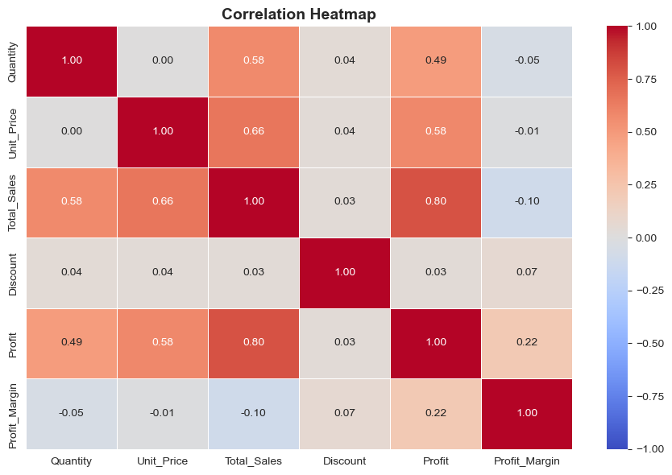
    


```python
fig, axes = plt.subplots(1, 2, figsize=(15, 6)) 
  
sns.boxplot(data=dt_balanced, x='Product_Category', y='Total_Sales', 
            palette='Blues', ax=axes[0]) 
axes[0].set_title('Sales Distribution by Category', fontweight='bold') 
axes[0].tick_params(axis='x', rotation=15) 
  
sns.boxplot(data=dt_balanced, x='Region', y='Profit', 
            palette='Greens', ax=axes[1]) 
axes[1].set_title('Profit Distribution by Region', fontweight='bold') 
  
plt.tight_layout() 
plt.show()
```


    
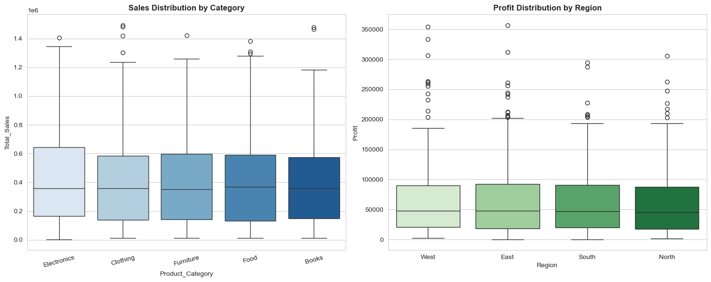
    


```python
gender_cat = ( 
    dt_balanced.groupby(['Gender','Product_Category'])['Total_Sales'] 
               .sum().reset_index() 
) 
  
fig, ax = plt.subplots(figsize=(12, 5)) 
sns.barplot(data=gender_cat, x='Product_Category', y='Total_Sales', 
            hue='Gender', 
            palette={'Female':'#E91E63','Male':'#1976D2'}, ax=ax) 
ax.set_title('Sales by Product Category and Gender', fontsize=13, 
fontweight='bold') 
ax.set_ylabel('Total Sales (₦)') 
ax.legend(title='Gender') 
plt.tight_layout() 
plt.show() 
ax.legend(title='Gender') 
plt.tight_layout() 
plt.show() 
```


    
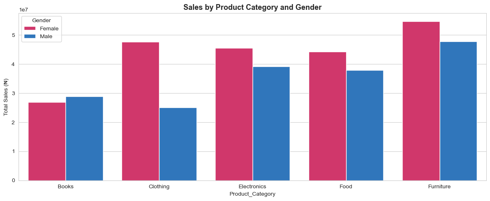
    


    <Figure size 1000x500 with 0 Axes>


```python
# Monthly trend 
monthly_trend = ( 
    dt_balanced.groupby(['Year','Month'])[['Total_Sales','Profit']] 
               .sum().reset_index().sort_values(['Year','Month']) 
) 
monthly_trend['Period'] = (monthly_trend['Year'].astype(str) + '-' 
                           + monthly_trend['Month'].astype(str).str.zfill(2)) 
  
# Category summary 
cat_summary = dt_balanced.groupby('Product_Category').agg( 
    Total_Sales=('Total_Sales','sum'), 
    Profit=('Profit','sum'), 
    Orders=('Order_ID','count') 
).reset_index() 
  
# Region summary 
region_summary = dt_balanced.groupby('Region').agg( 
    Total_Sales=('Total_Sales','sum'), 
    Profit=('Profit','sum') 
).reset_index() 
  
# Sales Rep summary 
rep_summary = dt_balanced.groupby('Sales_Rep').agg( 
    Total_Sales=('Total_Sales','sum'), 
    Profit=('Profit','sum'), 
    Orders=('Order_ID','count') 
).reset_index() 
  
# Payment method 
pay_summary = dt_balanced['Payment_Method'].value_counts().reset_index() 
pay_summary.columns = ['Payment_Method', 'Count'] 
  
print(' Summary tables ready!') 


```

     Summary tables ready!
    


```python
total_revenue = dt_balanced['Total_Sales'].sum() 
total_profit  = dt_balanced['Profit'].sum() 
avg_margin    = dt_balanced['Profit_Margin'].mean() 
total_orders  = dt_balanced['Order_ID'].nunique() 
  
fig = go.Figure() 
kpis = [ 
    ('💰 Total Revenue',     f'₦{total_revenue/1e6:.1f}M', '#1565C0'), 
    ('📈 Total Profit',      f'₦{total_profit/1e6:.1f}M',  '#2E7D32'), 
    ('📊 Avg Profit Margin', f'{avg_margin:.1f}%',          '#E65100'), 
    ('🛒 Total Orders',      f'{total_orders:,}',           '#6A1B9A'), 
] 
  
for i, (label, value, color) in enumerate(kpis): 
    fig.add_trace(go.Indicator( 
        mode='number', 
        value=None, 
        title={'text': f'<b>{label}</b><br>' 
               f'<span style="font-size:28px;color:{color}">{value}</span>', 
               'font': {'size': 19}}, 
        domain={'row': 0, 'column': i} 
    )) 
  
fig.update_layout( 
    grid={'rows': 1, 'columns': 4}, 
    height=300, 
    title='YDTA Sales Dashboard — Key Performance Indicators', 
    margin={'t': 60, 'b': 20} 
) 
fig.show()
```


    
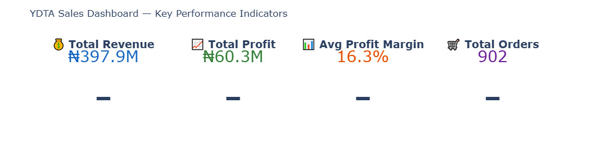
    


```python
fig = make_subplots( 
    rows=3, cols=2, 
    subplot_titles=[ 
        '📈 Monthly Revenue & Profit Trend',
        '🗂️ Sales by Product Category', 
        '🗺️ Revenue by Region', 
        '💳 Payment Method Share', 
        '👤 Sales Rep Performance', 
        '🔥 Category vs Region Heatmap' 
    ], 
    specs=[[{'colspan': 2}, None], [{}, {}], [{}, {}]], 
    vertical_spacing=0.10, horizontal_spacing=0.08 
) 
# Panel 1: Monthly Trend 
fig.add_trace(go.Scatter(x=monthly_trend['Period'], 
    y=monthly_trend['Total_Sales']/1e6, 
    mode='lines+markers', name='Revenue (M₦)', 
    line=dict(color='#1976D2', width=2)), row=1, col=1)
fig.add_trace(go.Scatter(x=monthly_trend['Period'], 
    y=monthly_trend['Profit']/1e6, 
    mode='lines+markers', name='Profit (M₦)', 
    line=dict(color='#4CAF50', width=2, dash='dot')), row=1, col=1)
# Panel 2: Category Sales 
cat_s = cat_summary.sort_values('Total_Sales', ascending=False) 
fig.add_trace(go.Bar(x=cat_s['Product_Category'], 
    y=cat_s['Total_Sales']/1e6, name='Sales by Category', 
    marker_color=['#1565C0','#1976D2','#2196F3','#42A5F5','#90CAF9'], 
    showlegend=False), row=2, col=1)
 # Panel 3: Region Revenue 
fig.add_trace(
    go.Bar(x=region_summary['Region'], 
    y=region_summary['Total_Sales']/1e6, name='Sales by Region', 
    marker_color=['#1B5E20','#2E7D32','#388E3C','#43A047'], 
    showlegend=False), row=2, col=2)  
 
# # Panel 4: Payment Method Pie 
# fig.add_trace(
#     go.Pie(
#     labels=pay_summary['Payment_Method'], 
#             values=pay_summary['Count'], hole=0.4), 
#     marker=dict(colors=['#1976D2','#4CAF50','#FF9800','#9C27B0'])), 
#     row=3, col=1) 
# Panel 5: Sales Rep 
fig.add_trace(go.Bar(x=rep_summary['Sales_Rep'], 
    y=rep_summary['Total_Sales']/1e6, 
    name='Rep Revenue', marker_color='#1976D2', showlegend=False), row=3, col=2) 
fig.add_trace(go.Bar(x=rep_summary['Sales_Rep'], 
    y=rep_summary['Profit']/1e6, 
    name='Rep Profit', marker_color='#4CAF50', showlegend=False), row=3, col=2)
fig.update_layout(height=1100, 
    title_text='📊 YDTA Sales Records — Interactive Dashboard', 
    title_font_size=18, template='plotly_white') 
fig.update_xaxes(tickangle=-45, row=1, col=1) 
fig.show()
```


```python
pivot = dt_balanced.pivot_table( 
    values='Total_Sales', index='Product_Category', 
    columns='Region', aggfunc='sum' 
) / 1e6 
  
fig = px.imshow( 
    pivot, text_auto='.1f', 
    color_continuous_scale='Blues', 
    title='🔥 Sales Heatmap: Product Category × Region (M₦)', 
    labels={'color': 'Sales (M₦)'} 
) 
fig.update_layout(height=400) 
fig.show() 
```


```python
fig = px.scatter( 
    dt_balanced.sample(300, random_state=42), 
    x='Unit_Price', y='Profit', 
    color='Product_Category', 
    size='Quantity', 
    hover_data=['Customer_Name','Region','Sales_Rep'], 
    title='💡Unit Price vs Profit (bubble size = quantity)', 
    labels={'Unit_Price':'Unit Price (₦)', 'Profit':'Profit (₦)'} 
) 
fig.update_layout(height=500) 
fig.show() 
```


```python
output_path = 'sales_records_cleaned.xlsx' 
dt_balanced.to_excel(output_path, index=False) 
print(f' Cleaned dataset saved to: {output_path}') 
print(f'  Final shape: {dt_balanced.shape[0]:,} rows × {dt_balanced.shape[1]} columns') 
```

     Cleaned dataset saved to: sales_records_cleaned.xlsx
      Final shape: 945 rows × 19 columns
    


```python

```
